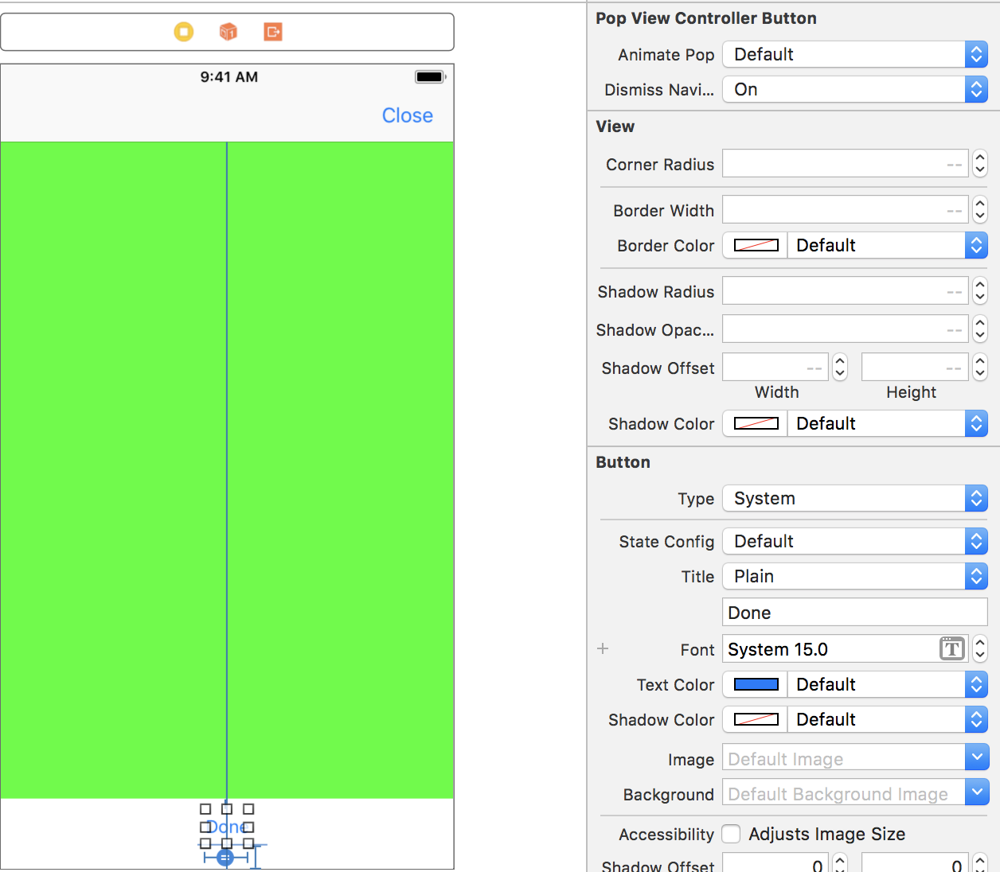
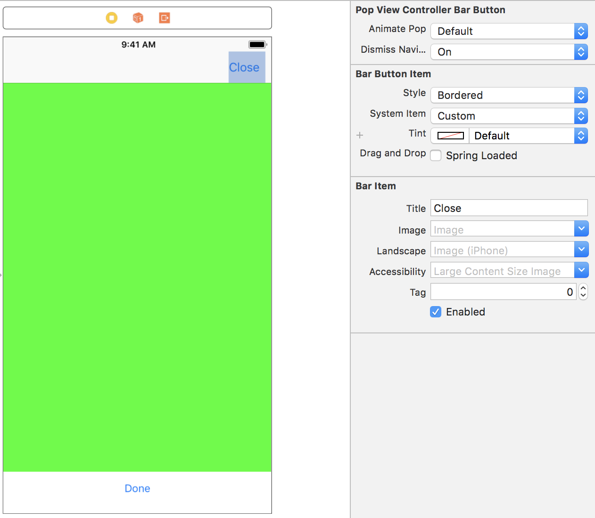

# iOS-ViewControllerPoppingButtons
InterfaceBuilder-friendly UIButton and UIBarButton subclasses that can be configured to pop or dismiss whatever view controller they're a part of.

## Usage
The UI element you want to use to pop view controllers will dismiss modals if the view controller it's a child of was presented modally and will pop view controllers if it's a child of a view controller that is embedded in a `UINavigationController` stack.

However, if you have presented a `UINavigationController` modally and don't want to pop a bunch of view controllers, set the `dismissNavigationController` boolean to `true` to dismiss the modal containing the navigation controller.

### UIButton
Change your button class to `PopViewControllerButton`. Configure it as you see fit in IB or programatically.



### UIBarButtonItem
Change your button class to `PopViewControllerBarButton`. Configure it as you see fit in IB or programatically.



### Any Other UI Element
The UI element must be a child class of `UIResponder`. Modify the UI element to conform to the `PopsViewController` protocol. Make sure that when you implement `tryPopController()` it calls the pre-pop hook and passes the hook the actual popping method as its argument. Without this, your UI element won't actually dismiss or pop the view controller. **TLDR: Copy/paste the following code:**

```swift
func tryPopController() {
  prePopHook(popViewController)
}
```

## License
Copyright 2018 Joseph Quigley

Permission is hereby granted, free of charge, to any person obtaining a copy of this software and associated documentation files (the "Software"), to deal in the Software without restriction, including without limitation the rights to use, copy, modify, merge, publish, distribute, sublicense, and/or sell copies of the Software, and to permit persons to whom the Software is furnished to do so, subject to the following conditions:

The above copyright notice and this permission notice shall be included in all copies or substantial portions of the Software.

THE SOFTWARE IS PROVIDED "AS IS", WITHOUT WARRANTY OF ANY KIND, EXPRESS OR IMPLIED, INCLUDING BUT NOT LIMITED TO THE WARRANTIES OF MERCHANTABILITY, FITNESS FOR A PARTICULAR PURPOSE AND NONINFRINGEMENT. IN NO EVENT SHALL THE AUTHORS OR COPYRIGHT HOLDERS BE LIABLE FOR ANY CLAIM, DAMAGES OR OTHER LIABILITY, WHETHER IN AN ACTION OF CONTRACT, TORT OR OTHERWISE, ARISING FROM, OUT OF OR IN CONNECTION WITH THE SOFTWARE OR THE USE OR OTHER DEALINGS IN THE SOFTWARE.
